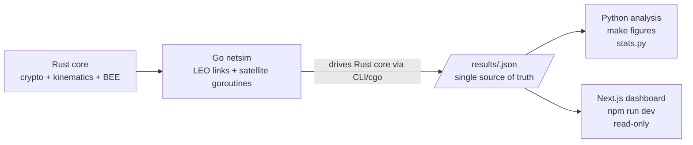

# ChaosSeal

**Reference implementation of the ChaosSeal revocation and resynchronization protocol for LEO satellite constellations.**

This monorepo implements the full experimental pipeline described in the IEEE Ad Hoc Networks submission: Rust protocol core → Go network simulator → structured JSON results → Python paper figures + Next.js live operator console.

**Honesty-first policy:** every number in the paper must trace back to `/results/*.json` produced by a real run. No mocked values, no hand-typed statistics.

---

## Table of Contents

1. [Architecture Overview](#architecture-overview)
2. [Pipeline](#pipeline)
3. [Component Reference](#component-reference)
   - [core (Rust)](#core-rust)
   - [netsim (Go)](#netsim-go)
   - [analysis (Python)](#analysis-python)
   - [dashboard (Next.js)](#dashboard-nextjs)
4. [Build & Test](#build--test)
5. [Reproducibility](#reproducibility)
6. [License](#license)

---

## Architecture Overview

```mermaid
flowchart TB
    subgraph CS [ChaosSeal Monorepo]
        direction TB
        CORE[/core (Rust)\nProtocol engine, KATs, C ABI/]
        NETSIM[/netsim (Go)\nSimulation driver, TLS 1.3 & BPSec baselines/]
        ANALYSIS[/analysis (Python)\nPaper figures, stats.py/]
        DASH[/dashboard (Next.js)\nLive operator console/]
    end

    CORE -->|libchaosseal_core.so/.a| NETSIM
    NETSIM -->|goroutines + cgo/FFI| RESULTS[(/results/*.json\nsingle source of truth)]
    RESULTS --> ANALYSIS
    RESULTS --> DASH
    
    NETSIM -->|real network events| NET[Real network\nevents, timestamps,\nbyte counts]
```

---

## Pipeline



### Data Flow Contract

1. **Rust → Go:** Go calls the Rust CLI (`chaosseal lyapunov ...`, `chaosseal beesize ...`) or links against `libchaosseal_core`. The Rust side emits JSON to stdout; Go parses it.
2. **Go → results:** Every simulation run writes exactly one JSON file to `/results`. The schema is documented in `netsim/README.md`.
3. **results → Python:** `analysis/` scripts read `/results/*.json` only. They never recompute protocol logic.
4. **results → dashboard:** The dashboard reads the same JSON files via a read-only API route or static serving. It must not reimplement protocol or simulation logic.

---

## Component Reference

### core (Rust)

**Path:** `core/`

The source of truth for all protocol logic.

| Module | Purpose |
|--------|---------|
| `fixed` | Q32.32 fixed-point arithmetic (no floats in hot path) |
| `kinematics` | Multi-pendulum ODE system + RK4 integrator, fixed-point throughout |
| `lyapunov` | Benettin algorithm for Lyapunov exponent estimator (`λ1`) |
| `crypto` | HKDF → AES-256-CTR (vetted crates), HMAC-SHA256 commitment |
| `bee` | Subset-difference key tree, covering-set algorithm, ciphertext serialization |
| `bindings` | C ABI via `cbindgen` for cgo consumption |
| `bin` | CLI (`clap`) that emits JSON |

**Dependencies (vetted crates, no hand-rolled crypto):**
- `aes`, `ctr` — AES-256-CTR
- `hkdf` — RFC 5869 key derivation
- `hmac`, `sha2` — HMAC-SHA256
- `cbindgen` — C header generation
- `clap` — CLI

**Known-Answer Tests (KATs):**
- `tests/kat.rs` — AES-CTR encrypt/decrypt round-trip, HMAC-SHA256 against RFC 4231 vectors
- In-module tests — determinism (same seed → bit-exact output across runs)

**Build:**
```bash
cargo build --manifest-path core/Cargo.toml
cargo test --manifest-path core/Cargo.toml
```

**C ABI header:** generated at build time to `target/.../chaosseal_core.h`.

---

### netsim (Go)

**Path:** `netsim/`

Network simulation orchestration. Drives N satellite goroutines + 1 ground station goroutine, each calling into the Rust core.

| Feature | Implementation |
|---------|----------------|
| LEO link model | Visibility windows, elevation-dependent latency, Gilbert-Elliott loss bursts |
| TLS 1.3 baseline | Real `crypto/tls` handshake over simulated link |
| BPv7 / BPSec baseline | CBOR-encoded bundles (RFC 9171) with BIB (HMAC-SHA256) and BCB (AES-256-GCM) canonical blocks (RFC 9172) |
| Results emission | One JSON file per run to `/results` |

**Design decisions documented in `netsim/README.md`:**
- Why BPSec was implemented against the RFCs directly (no viable Go ≥ 1.22 dependency at time of writing).
- RNG seed logging for reproducibility.

---

### analysis (Python)

**Path:** `analysis/`

Reads `/results/*.json` only. Never recomputes protocol logic.

| Script | Purpose |
|--------|---------|
| `stats.py` | Prints actual numbers (mean / median / p95) quoted in the paper |
| `figures.py` | Generates the 3 paper figures via matplotlib |

**Figures:**
1. BEE ciphertext size vs |R|
2. Resynchronization latency distribution
3. Throughput comparison (ChaosSeal vs TLS 1.3 vs BPSec)

**Style:** serif fonts, no gridlines by default, vector PDF output.

**Run:**
```bash
cd analysis
make figures
```

---

### dashboard (Next.js)

**Path:** `dashboard/`

Live operator console. **Not the source of truth for paper numbers.**

| View | Description |
|------|-------------|
| Live swarm state | Real-time satellite positions and link status during a run |
| Revocation events | Stream of BEE revocation events as they happen |
| Replay | Step-through view for completed runs |
| Comparison | CEP vs TLS vs BPSec for quick eyeballing |

**Constraint:** reads the same `/results/*.json` files. Must not reimplement protocol or simulation logic.

**Run:**
```bash
cd dashboard
npm install
npm run dev
```

---

## Build & Test

### Prerequisites

- Rust ≥ 1.75 (for `clap` derive and edition 2021)
- Go ≥ 1.22
- Python ≥ 3.10 (matplotlib, numpy)
- Node.js ≥ 18 (Next.js)

### Rust core

```bash
cd core
cargo build
cargo test
```

Expected: 19 tests pass (KATs + determinism + scaling).

### Go netsim (smoke test)

```bash
cd netsim
go mod init github.com/chaosseal/netsim  # if first run
go test ./...
```

### Python analysis

```bash
cd analysis
pip install matplotlib numpy
make figures
```

### Next.js dashboard

```bash
cd dashboard
npm install
npm run dev
```

---

## Reproducibility

Every `/results/*.json` file records:

| Field | Description |
|-------|-------------|
| `git_commit` | Full commit hash at time of run |
| `rng_seed` | 64-bit seed used for the simulation |
| `parameters` | Complete parameter set (pendulum count, masses, damping, BEE `N`/`R`, loss model coefficients, etc.) |

To reproduce a specific run:

```bash
git checkout <commit_hash>
cd netsim
go run . --seed <rng_seed> --config <parameter_json>
```

The Python `stats.py` script reads the same JSON and reports the exact numbers quoted in the paper. **Never hand-type a number into the paper that isn't traceable to `stats.py` output.**

---

## License

MIT — permissive academic reference implementation. Chosen because:
- It imposes no restrictions on downstream use (commercial or academic).
- It is the standard license for protocol reference implementations in the systems/networking community.
- Apache-2.0 is a reasonable alternative; we chose MIT for brevity and broad compatibility.

If you build on this work, please cite the paper and consider contributing improvements back.

---

## Status

| Component | Status |
|-----------|--------|
| core (Rust) | Compiling, 19/19 tests passing |
| netsim (Go) | Placeholder directories (next deliverable) |
| analysis (Python) | Placeholder directories (next deliverable) |
| dashboard (Next.js) | Placeholder directories (last deliverable) |

Deliverable order per project plan:
1. Rust core with KATs passing ✅
2. Go netsim + TLS 1.3 baseline + BPSec baseline
3. Python analysis producing 3 paper figures
4. Next.js dashboard
